<p align="center">
  
</p>

<h1 align="center">MCP Odoo</h1>

<p align="center">
  <a href="https://github.com/fgribreau/mcp-odoo/actions/workflows/ci.yml"></a>
  <a href="LICENSE"></a>
  <a href="https://www.rust-lang.org/"></a>
  <a href="https://modelcontextprotocol.io"></a>
  <a href="https://www.odoo.com"></a>
</p>

<p align="center">
  <strong>A Model Context Protocol (MCP) server that exposes any Odoo 19+ instance to Claude and other MCP-compatible AI assistants via the native JSON/2 API.</strong>
</p>

---

## Sponsors

<table>
  <tr>
    <td align="center" width="175">
      <a href="https://france-nuage.fr/?mtm_source=github&mtm_medium=sponsor&mtm_campaign=france-nuage&mtm_content=mcp-odoo">
        <br/>
        <b>France-Nuage</b>
      </a><br/>
      <sub>Host Odoo on sovereign French cloud. Re-internalise when you choose.</sub>
    </td>
    <td align="center" width="175">
      <a href="https://www.hook0.com/?mtm_source=github&mtm_medium=sponsor&mtm_campaign=hook0&mtm_content=mcp-odoo">
        <br/>
        <b>Hook0</b>
      </a><br/>
      <sub>Send signed Odoo webhooks reliably. Self-hosted, retries handled.</sub>
    </td>
    <td align="center" width="175">
      <a href="https://getnatalia.com/?mtm_source=github&mtm_medium=sponsor&mtm_campaign=natalia&mtm_content=mcp-odoo">
        <br/>
        <b>Natalia</b>
      </a><br/>
      <sub>AI voice agent feeds qualified leads straight into your Odoo CRM 24/7.</sub>
    </td>
    <td align="center" width="175">
      <a href="https://netir.fr/?mtm_source=github&mtm_medium=sponsor&mtm_campaign=netir&mtm_content=mcp-odoo">
        <br/>
        <b>NetIR</b>
      </a><br/>
      <sub>Hire vetted French freelance Odoo devs via mentored marketplace.</sub>
    </td>
  </tr>
  <tr>
    <td align="center" width="233">
      <a href="https://nobullshitconseil.com/?mtm_source=github&mtm_medium=sponsor&mtm_campaign=nbc&mtm_content=mcp-odoo">
        <br/>
        <b>NoBullshitConseil</b>
      </a><br/>
      <sub>No-bullshit tech advisory. ERP &amp; platform strategy for execs.</sub>
    </td>
    <td align="center" width="233">
      <a href="https://qualneo.fr/?mtm_source=github&mtm_medium=sponsor&mtm_campaign=qualneo&mtm_content=mcp-odoo">
        <br/>
        <b>Qualneo</b>
      </a><br/>
      <sub>Qualiopi LMS that syncs trainees &amp; invoices to your Odoo backend.</sub>
    </td>
    <td align="center" width="233">
      <a href="https://recapro.ai/?mtm_source=github&mtm_medium=sponsor&mtm_campaign=recapro&mtm_content=mcp-odoo">
        <br/>
        <b>Recapro</b>
      </a><br/>
      <sub>Sovereign AI logs sales calls into Odoo activities automatically.</sub>
    </td>
  </tr>
</table>

> **Interested in sponsoring?** [Get in touch](mailto:rust@fgribreau.com)

## Overview

A Rust MCP server that **dynamically discovers** your Odoo models and exposes them as tools. Claude (or any MCP client) can browse, search, read, create, update, and delete records on your Odoo instance through the native JSON/2 API — no plugin to install on the Odoo side, just an API key.

### Features

- **Dynamic discovery** — automatically lists and introspects all accessible Odoo models
- **Full CRUD** — `search`, `read`, `create`, `write`, `delete` records on any model
- **Arbitrary methods** — call any public ORM method via `call_method`
- **Glob filtering** — include/exclude models with patterns (`sale.*`, `!ir.logging`)
- **Read-only mode** — block all write operations for safe production observability
- **Pagination** — configurable page size with `has_more` / `next_offset` metadata
- **Structured errors** — HTTP 401 / 403 / 404 / 422 / 500 mapped to MCP errors
- **Fast & small** — single Rust binary, no runtime dependencies

## Install

### Homebrew (macOS / Linux)

```bash
brew tap FGRibreau/tap
brew install mcp-server-odoo
```

### Cargo

```bash
cargo install mcp-server-odoo
```

### `cargo binstall` (prebuilt binary, no compile)

```bash
cargo binstall mcp-server-odoo
```

### Prebuilt binaries

Grab a tarball/zip for your platform from [Releases](https://github.com/fgribreau/mcp-odoo/releases). Targets shipped:

`x86_64-unknown-linux-gnu`, `aarch64-unknown-linux-gnu`, `x86_64-unknown-linux-musl`, `aarch64-unknown-linux-musl`, `x86_64-apple-darwin`, `aarch64-apple-darwin`, `x86_64-pc-windows-msvc`, `aarch64-pc-windows-msvc`.

### From source

```bash
git clone https://github.com/fgribreau/mcp-odoo.git
cd mcp-odoo
cargo build --release
```

## Quick Start

### Prerequisites

- An Odoo 19+ instance with API access
- An Odoo API key (`Bearer` token) — see below

### 1. Configure

```bash
cp .env.example .env
# Edit .env with your values — every variable is documented inline
```

### 2. Add to Claude Code

```bash
claude mcp add odoo \
  --command mcp-server-odoo \
  --env "ODOO_URL=https://your-odoo-instance.com" \
  --env "ODOO_API_KEY=YOUR_API_KEY" \
  --env "ODOO_DB=your-database"
```

<details>
<summary>How to get your Odoo API key</summary>

1. Log into Odoo as the user you want the MCP server to act as
2. Click your avatar (top-right) → **My Profile** → **Account Security** tab
3. Under **API Keys**, click **New API Key**
4. Set **Name** to `mcp-server`, **Scope** to `rpc`, choose an expiration date
5. Click **Generate Key** — **copy it immediately**, it is shown only once

**Verify it works:**

```bash
curl -s -o /dev/null -w "%{http_code}\n" \
  -X POST https://your-odoo.com/json/2/res.users/search \
  -H "Authorization: Bearer YOUR_KEY" \
  -H "Content-Type: application/json" \
  -H "X-Odoo-Database: your-db" \
  -d '{"domain": [["id","=",1]]}'
# 200 = valid, 401 = invalid key, 403 = missing permissions
```

> **Security:** for production, create a dedicated Odoo user with minimal access rights, restrict its groups to only the models you need, and rotate keys regularly.

</details>

## Configuration

### Claude Code

The recommended way is via the CLI:

```bash
claude mcp add odoo \
  --command /absolute/path/to/mcp-server-odoo \
  --env "ODOO_URL=https://your-odoo-instance.com" \
  --env "ODOO_API_KEY=YOUR_API_KEY" \
  --env "ODOO_DB=your-database" \
  --env "READ_ONLY=true"
```

Or manually in your MCP settings file:

```json
{
  "mcpServers": {
    "odoo": {
      "command": "/absolute/path/to/mcp-server-odoo",
      "env": {
        "ODOO_URL": "https://your-odoo-instance.com",
        "ODOO_API_KEY": "YOUR_API_KEY",
        "ODOO_DB": "your-database",
        "READ_ONLY": "true"
      }
    }
  }
}
```

### Claude Desktop

Add to `~/Library/Application Support/Claude/claude_desktop_config.json` (macOS) or `%APPDATA%\Claude\claude_desktop_config.json` (Windows):

```json
{
  "mcpServers": {
    "odoo": {
      "command": "/absolute/path/to/mcp-server-odoo",
      "env": {
        "ODOO_URL": "https://your-odoo-instance.com",
        "ODOO_API_KEY": "YOUR_API_KEY",
        "ODOO_DB": "your-database"
      }
    }
  }
}
```

### Environment variables

All options can be set via env vars **or** CLI flags (`--odoo-url`, `--odoo-api-key`, `--odoo-db`, ...). The `.env.example` file contains exhaustive documentation for every variable, including where to find each value, how to verify it, and security recommendations.

| Variable | Required | Default | Description |
|----------|----------|---------|-------------|
| `ODOO_URL` | **yes** | — | Base URL of your Odoo instance (no trailing slash) |
| `ODOO_API_KEY` | **yes** | — | API key (Bearer token) for JSON/2 authentication |
| `ODOO_DB` | **yes** | — | PostgreSQL database name |
| `MODEL_INCLUDE` | no | `*` | Comma-separated glob patterns for models to expose |
| `MODEL_EXCLUDE` | no | *(empty)* | Comma-separated glob patterns for models to hide |
| `READ_ONLY` | no | `false` | Block all write operations |
| `PAGE_SIZE` | no | `80` | Default records per `search` page |

### Model filtering

Glob patterns let you control which Odoo models are exposed. **Exclude always takes precedence over include.**

```bash
# Only sales + contacts
MODEL_INCLUDE="sale.*,res.partner"

# Everything except internals and logs
MODEL_EXCLUDE="ir.*,bus.*,base.*"

# Accounting except sequences
MODEL_INCLUDE="account.*"
MODEL_EXCLUDE="account.sequence*"
```

<details>
<summary>Common Odoo model prefixes</summary>

| Prefix | Module | Examples |
|--------|--------|----------|
| `res.*` | Core resources | `res.partner`, `res.users`, `res.company` |
| `sale.*` | Sales | `sale.order`, `sale.order.line` |
| `purchase.*` | Purchasing | `purchase.order`, `purchase.order.line` |
| `account.*` | Accounting | `account.move`, `account.payment`, `account.journal` |
| `stock.*` | Inventory | `stock.picking`, `stock.move`, `stock.warehouse` |
| `hr.*` | HR | `hr.employee`, `hr.contract`, `hr.leave` |
| `project.*` | Projects | `project.project`, `project.task` |
| `crm.*` | CRM | `crm.lead`, `crm.team` |
| `product.*` | Products | `product.product`, `product.template` |
| `ir.*` | Internal/system (usually excluded) | `ir.model`, `ir.cron`, `ir.logging` |
| `bus.*` | Real-time bus (usually excluded) | `bus.bus`, `bus.presence` |

</details>

### Read-only mode

When `READ_ONLY=true`, the server blocks `create`, `write`, `delete`, and most `call_method` invocations. The following methods remain **always allowed**:

| Always allowed | Prefix-based |
|---------------|--------------|
| `name_get`, `name_search`, `read_group` | `get_*` |
| `fields_get`, `search`, `search_read` | `check_*`, `has_*` |
| `search_count`, `default_get` | `is_*`, `can_*` |

> **Recommended:** set `READ_ONLY=true` when connecting to production, exploring data, or first-time setup.

## Usage examples

Once configured, you can ask Claude questions like:

- *"List my 10 most recent sale orders with their total and customer."*
- *"Find all contacts at companies in France that bought from us in the last 90 days."*
- *"Show me the stock levels for products in the warehouse 'WH/Stock'."*
- *"Create a new opportunity for Acme Corp with expected revenue €25,000."*
- *"Mark sale order SO0042 as confirmed."*

Claude will pick the right tool (`search`, `read`, `create`, `write`, `call_method`, ...) and run it on your Odoo instance.

## Available tools

| Tool | Parameters | Description |
|------|------------|-------------|
| `list_models` | *(none)* | List all accessible models (filtered by config) |
| `describe_model` | `model` | Get field definitions for a model |
| `search` | `model`, `domain`, `fields?`, `limit?`, `offset?`, `order?` | Search records with pagination |
| `read` | `model`, `ids`, `fields?` | Read records by ID |
| `create` | `model`, `values` | Create a new record |
| `write` | `model`, `ids`, `values` | Update existing records |
| `delete` | `model`, `ids` | Delete records by ID |
| `call_method` | `model`, `method`, `ids?`, `kwargs?` | Call any public ORM method |

### Examples

**Search for company customers:**
```json
{
  "model": "res.partner",
  "domain": [["is_company", "=", true], ["customer_rank", ">", 0]],
  "fields": ["name", "email", "country_id"],
  "limit": 10
}
```

**Read a specific sale order:**
```json
{
  "model": "sale.order",
  "ids": [42],
  "fields": ["name", "state", "amount_total", "partner_id"]
}
```

**Create a contact:**
```json
{
  "model": "res.partner",
  "values": { "name": "Acme Corp", "is_company": true, "email": "info@acme.com" }
}
```

**Confirm a sale order via `call_method`:**
```json
{ "model": "sale.order", "method": "action_confirm", "ids": [42] }
```

## CLI reference

```
mcp-server-odoo [OPTIONS]

Options:
      --odoo-url <ODOO_URL>          URL of the Odoo instance [env: ODOO_URL]
      --odoo-api-key <ODOO_API_KEY>  Bearer token for Odoo API authentication [env: ODOO_API_KEY]
      --odoo-db <ODOO_DB>            Odoo database name [env: ODOO_DB]
      --model-include <PATTERNS>     Comma-separated glob patterns for inclusion [env: MODEL_INCLUDE] [default: *]
      --model-exclude <PATTERNS>     Comma-separated glob patterns for exclusion [env: MODEL_EXCLUDE]
      --read-only                    Block all write operations [env: READ_ONLY]
      --page-size <PAGE_SIZE>        Default page size for list operations [env: PAGE_SIZE] [default: 80]
  -h, --help                         Print help
  -V, --version                      Print version
```

## Development

```bash
# Build debug version
cargo build

# Run unit tests
cargo test

# Run unit + integration tests (requires a live Odoo instance)
cargo test --features integration

# Run with verbose logging
RUST_LOG=debug ./target/debug/mcp-server-odoo
```

Integration tests require additional env vars: `ODOO_TEST_URL`, `ODOO_TEST_API_KEY`, `ODOO_TEST_DB`. A `docker-compose.test.yml` is provided to spin up a disposable Odoo 19 + Postgres for testing:

```bash
docker compose -f docker-compose.test.yml up -d
until curl -sf http://localhost:18069/web/login; do sleep 2; done
ODOO_TEST_URL=http://localhost:18069 ODOO_TEST_DB=test_odoo \
  cargo test --features integration
docker compose -f docker-compose.test.yml down -v
```

## Troubleshooting

### `401 Unauthorized`

1. Verify your API key is correct (`ODOO_API_KEY`).
2. Check that the key has scope `rpc` and has not expired.
3. Make sure the user owning the key has at least *read* permission on the models you query.

### `403 Forbidden`

The key is valid but the underlying user lacks access to a specific model. Adjust the user's groups in Odoo, or add the model to `MODEL_EXCLUDE` if you don't need it.

### `404 Not Found` on `/json/2/...`

The JSON/2 endpoint is only available on **Odoo 19+**. Older versions only ship XML-RPC and the legacy JSON-RPC endpoint.

### `Could not connect` / timeouts

1. Verify `ODOO_URL` is reachable from your machine (try a `curl`).
2. Check for firewalls / VPN / Cloudflare Access in front of the instance.
3. Make sure the URL includes the protocol (`https://`).

### "No models available"

Your `MODEL_INCLUDE` / `MODEL_EXCLUDE` patterns may be filtering everything out. Run with `RUST_LOG=debug` to see what was discovered and what was filtered.

## Contributing

Contributions are welcome — please open an issue first if you plan a substantial change. Run `cargo fmt && cargo clippy --all-targets -- -D warnings` before submitting a PR.

## License

MIT — see [LICENSE](LICENSE).

## Acknowledgments

- Built with [rmcp](https://github.com/modelcontextprotocol/rust-sdk) — Rust MCP SDK
- Inspired by the [Model Context Protocol](https://modelcontextprotocol.io/) specification
- Designed for the [Odoo JSON/2 API](https://www.odoo.com/documentation/19.0/developer/reference/external_api.html) (Odoo 19+)
